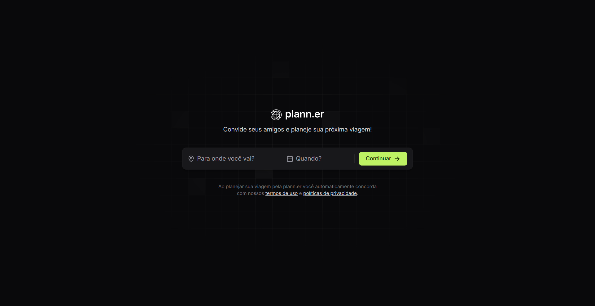

 

 
<h3 align="center"> plann.er </h3> 

 Um aplicativo para criar e organizar viagens em grupo de maneira eficiente e colaborativa. 
 

#### Tecnologias Utilizadas
Este projeto foi desenvolvido utilizando as seguintes tecnologias:
- HTML, TailwindCSS e TypeScript para a construção da interface do usuário
- Git e GitHub para controle de versão e colaboração
- Figma para a criação do layout e design do aplicativo
- ReactJS, uma biblioteca JavaScript para construção de interfaces
#### Sobre o Projeto
O plann.er é um aplicativo idealizado pela Rocketseat, uma plataforma de ensino de programação. O projeto foi criado seguindo as aulas da trilha de ReactJS do NLW Journey, um evento online promovido pela Rocketseat.
O objetivo do plann.er é fornecer uma ferramenta intuitiva e fácil de usar para que grupos de pessoas possam planejar e organizar viagens em conjunto. Com recursos de colaboração e compartilhamento, o aplicativo permite que todos os membros do grupo participem ativamente do processo de planejamento, desde a escolha do destino até a definição de atividades e orçamento.
##### Layout do Aplicativo
O layout do plann.er foi criado no Figma, uma ferramenta de design de interface. Você pode acessar o projeto no Figma através do seguinte link:
[Projeto no Figma](https://www.figma.com/community/file/1392276515495389646/nlw-journey-planejador-de-viagem)
